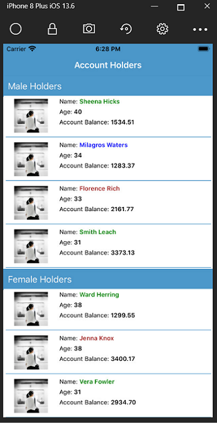

# Accounts App

Access and lists active accounts
- TBA - detail explanation

# Screenshots
|  |  |

# Notes
- Please note that the service location is not set in the GitHub repository, if you like to run this app locally then would need to set the url in code (search for “CheckMe!”)

# TODO

  - Ability to select the sorting criteria
  - Improve user interface
  - Add Account detail page
  - Ability to turn on and off groups
 ## License

See the [license file](LICENSE)

